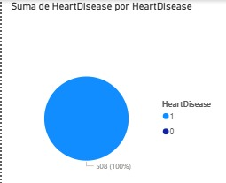
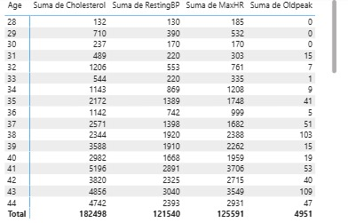
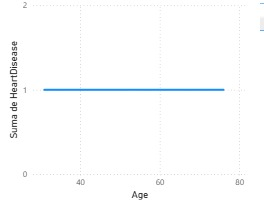
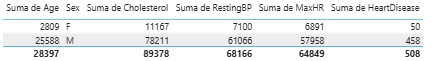
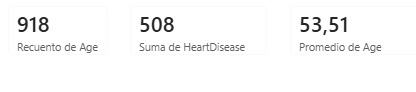
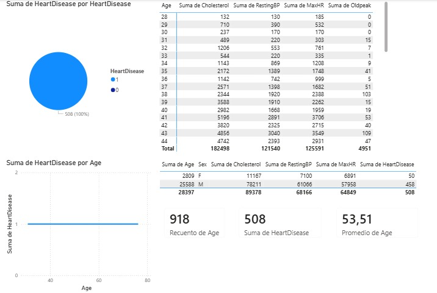

# KafkaMed — Plataforma de Streaming Clinico para Prediccion de Riesgo Cardiaco

KafkaMed es una plataforma Big Data que simula el monitoreo cardiaco en streaming. El sistema publica registros clinicos en Kafka, los procesa con Spark Structured Streaming, aplica un modelo ML de riesgo cardiaco, persiste resultados en MongoDB y expone datos mediante una API Flask. El dashboard Power BI consume la API REST, no MongoDB directamente.

## Arquitectura resumida

```text
Dataset clinico
-> Kafka Producer
-> Kafka topic heart-records
-> Spark Structured Streaming
-> Modelo ML
-> MongoDB
-> Flask API
-> Power BI
```

## Tecnologias

| Tecnologia | Uso |
|---|---|
| Python | Productor, API, scripts ML |
| Apache Kafka | Broker de eventos clinicos |
| PySpark Structured Streaming | Consumo y procesamiento streaming |
| MongoDB | Persistencia de registros y predicciones |
| Flask | API REST clinica |
| scikit-learn | Modelo de clasificacion |
| Docker Compose | Orquestacion local |
| Power BI | Dashboard de analitica clinica |

## Estado de fases

| Fase | Componente | Estado |
|---|---|---|
| 1 | Kafka Producer | Validado |
| 2 | Spark leyendo Kafka | Validado |
| 3 | Spark persistiendo en MongoDB | Validado |
| 4 | Modelo ML | Validado |
| 4.5 | Reentrenamiento con dataset completo | Validado |
| 5 | Spark + ML + MongoDB | Validado |
| 6 | API Flask clinica | Validado |
| 7 | Power BI | Dashboard creado; evidencias visuales adjuntas |

## Dataset

- Dataset: Heart Failure Prediction
- Archivo: `data/raw/heart_failure_prediction.csv`
- Registros: `918`
- Variables: `12`
- Distribucion:
  - `HeartDisease=1`: `508`
  - `HeartDisease=0`: `410`

## Metricas del modelo

| Metrica | Valor |
|---|---:|
| accuracy | `0.8967` |
| precision | `0.8879` |
| recall | `0.9314` |
| f1 | `0.9091` |
| roc_auc | `0.9296` |

## API Flask

Base local:

```text
http://localhost:8000
```

Endpoints:

- `/health`
- `/patients`
- `/predictions`
- `/stats`
- `/risk-summary`

## Dashboard Power BI

El dashboard consume la API Flask y visualiza:

- total de registros;
- distribucion `risk` / `no_risk`;
- probabilidad promedio;
- analisis clinico por edad, sexo y variables cardiacas;
- tabla de predicciones.













## Comandos para demo

```powershell
docker compose up -d kafka mongo api
python kafka/producer.py --limit 5
docker compose --profile processing run --rm spark-heart-ml-mongo
```

Endpoints para abrir:

```text
http://localhost:8000/health
http://localhost:8000/stats
http://localhost:8000/risk-summary
http://localhost:8000/predictions?limit=5
```

## Guion rapido de exposicion

1. Mostrar arquitectura.
2. Mostrar Kafka Producer.
3. Mostrar Spark + ML + MongoDB.
4. Mostrar API Flask.
5. Mostrar Power BI.
6. Cerrar con metricas y conclusiones.

## Documentacion completa

- `docs/pruebas/reporte_estado_integral_kafkamed.md`
- `docs/pruebas/reporte_fase_7_powerbi.md`
- `docs/pruebas/reporte_fase_6_api_flask.md`
- `docs/pruebas/reporte_fase_5_ml_streaming_mongo.md`
- `docs/pruebas/reporte_fase_4_5_dataset_completo_ml.md`
- `docs/pruebas/reporte_fase_3_spark_mongo.md`
- `docs/pruebas/reporte_fase_2_spark_kafka.md`
- `docs/pruebas/reporte_fase_1_kafka_producer.md`
